#  Experiment E6 -- Offline learning from Exp 3 data
##  Phase P0
### Objectives: 
- Perform offline learning using data from Exp 3
- Test the following design: state = (TOC, daily photon counts), reward = daily growth
### Methods: 
- Set up the code base for offline learning 
- Let reward be the difference between daily peaks, given at the last time stamp of each day
- Daily photon counts is a way to keep track of how much light the plants have received so far today. In the simple action space [0, 1], let photon_counts = sum(actions taken so far today)
- Everything is scaled to its daily values. 
### Observations: 
- If using only constant-agent's data, 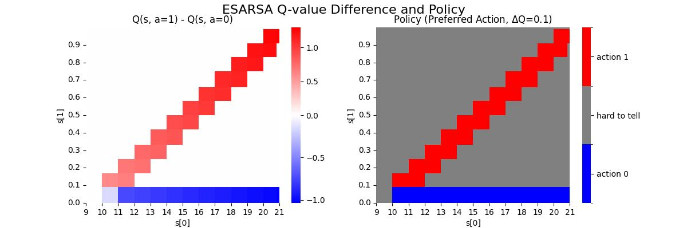
- If using all data for 300000 steps, 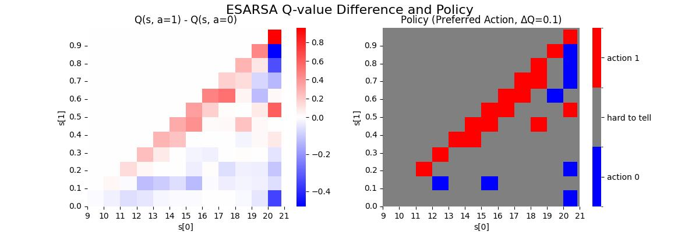
- If using only non-constant-agents' data, 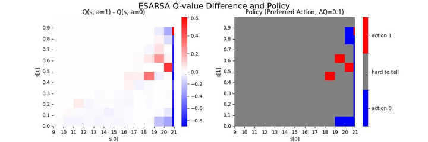
(Note: there are small experimental changes between these three results)
- These imply that our data is not good for offline learning. 
### Conclusions & Outlooks: 
- How to better collect data?

##  Phase P1
### Objectives: 
- Since our Exp 3 data was collected at 10 min time step & and we want TOD to be every hour, a state often goes back to itself. I want to avoid this by simulating 1hr time step using Exp 3 data.
### Methods: 
- See env subclass OfflinePlantGrowthChamber_1hrStep
- Use only non-constant agents' data
- Replay 500000 steps with batch size 64
### Observations: 
- Advantage and policy:
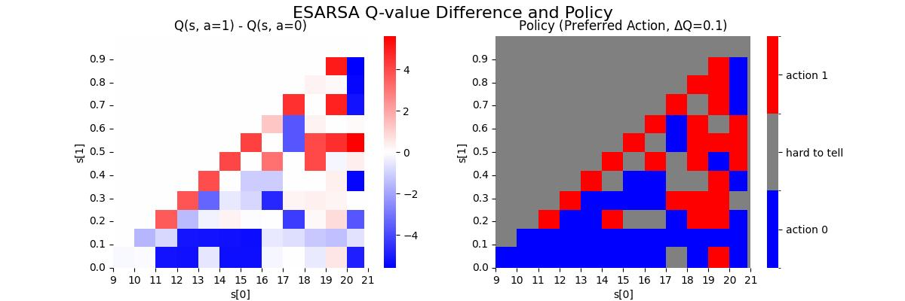
- Q-values
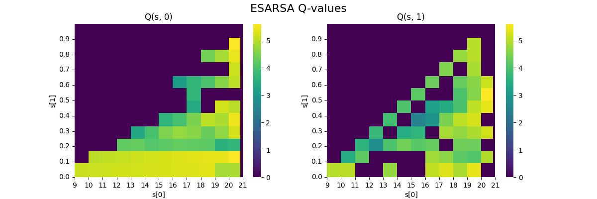
- The state coverage is much better than P0.
- Despite not having the constant agents' data, the optimal policy shows red in the diagonal.
### Conclusions & Outlooks: 
- State aggregation is a poor way of lumping our TOD together, likely because a state often goes back to itself. Manipulate the data so that step = 1hr works much better. 

##  Phase P2
### Objectives: 
- While "photon count" alone doesn't really make a sensible state (it has to be paired with TOD), we could try using "daily area" alone as the state. The agent could reason that, if the area appears large compared to the typical area of the day, then more light should be applied.
### Methods: 
- Use 1hr time step as in P1
- ob = daily area
- reward is daily growth (max to max), but given at all time steps. In other words, all steps during the same day receive the same reward.
- gamma is set to 0 to remove bootstrapping.
- This setup is Monte carlo with daily episodes.
- Note that the plots are hacked. The x-axis is daily area. The y-axis is just a place holder. The x tick labels are wrong; should go from 0.75 to 1.05.
### Observations: 
- Using only non-constant agents' data, the q-values show higher preference for action 1 near when the area is large: 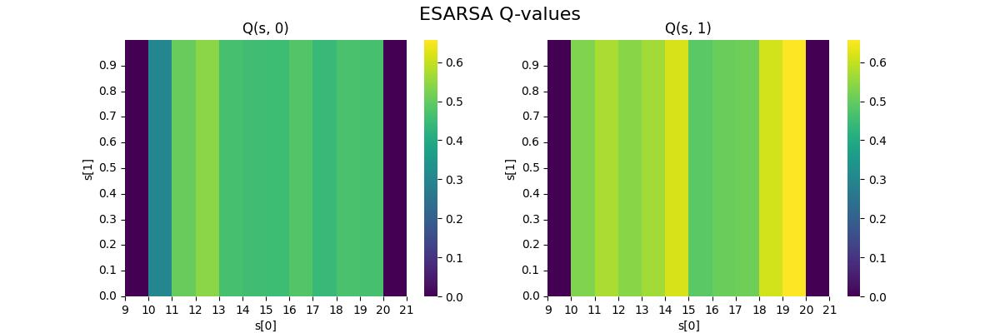
- Overall the advantage is positive for action 1: 
### Conclusions & Outlooks: 
- Using daily area alone as the state seems promising. Note that the state is not Markov, so cannot be used with bootstrapping methods. Further investigation is needed to confirm the result.

##  Phase P3
### Objectives: 
- See how effective Monte carlo method is with other state defs
### Methods: 
- Same as P2, but daily area is replaced by TOD
- use only non-constant agents' data
### Observations: 
- The q-values show similar result as P2. The difference in q-values is the largest around early afternoon, when the daily area is the largest: 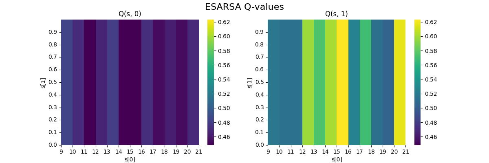
### Conclusions & Outlooks: 
- There is indeed a detectable larger advantage when area is max (i.e. around noon)

##  Phase P4
### Objectives: 
- Same as P3, but state = photon counts
### Methods: 
- use only non-constant agents' data
### Observations: 
- There is no clear pattern 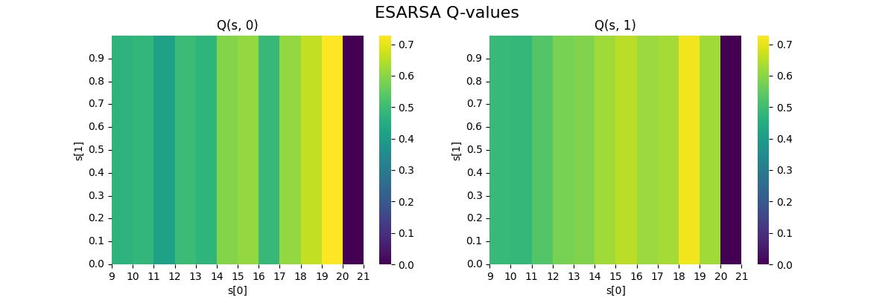
### Conclusions & Outlooks: 
- I am starting to think cumulative action is not that great. Plus, its trajectory is very treelike (bad state coverage).

##  Phase P5
### Objectives: 
- Consolidate what was learned from P2-P4 and clean up the code
### Methods: 
- Added a subclass OfflinePlantGrowthChamber_1hrStep_MC which generates experience tuples with MC target (daily return) as the reward. Note that here we're working with the daily episode scenario.
- State = (TOC, daily area)
- Agent = TC linear ESARSA. 
- tile coder here uses the OR operation. i.e. TC = tile(TOC) + tile (area)
### Observations: 
300000 replay steps:
- 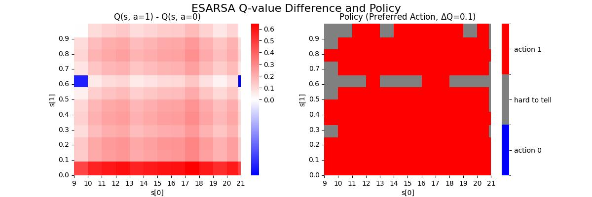
- 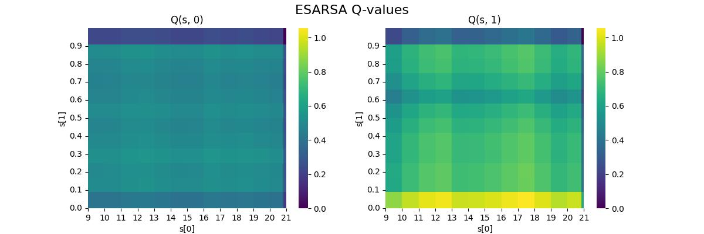
- The agent indeed learned the optimal policy very well. 
- There is some strangely high advantage for small area. It could be due to lack of data there to average out anomalous measurements? 
- There is no heightened preference for action 1 around noon or around peak area. 
### Conclusions & Outlooks: 
- MC target works really well with no problem learning over the whole state space. That being said, the feature vector was very small (26).
- Try AND operation in TC and see if the agent picks out special regions that especially prefer action 1.

##  Phase P6
### Objectives: 
- Same as P5 but with AND operation in TC
### Methods: 
- tile code = 2dtile(tod, area). tiles = 12. tilings = 1
### Observations: 
- 300000 replay steps:
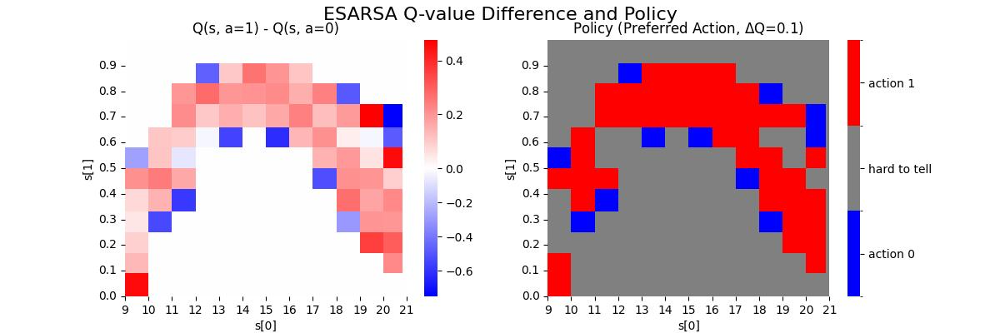
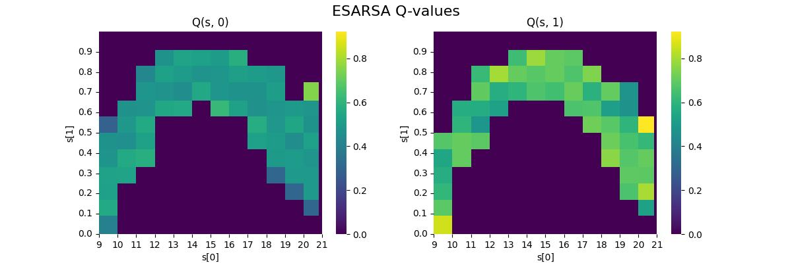
- Not the whole state space is covered, but where it is covered, the agent learned to choose action 1
### Conclusions & Outlooks: 
- This result is fine, but I think because noon doesn't always coincide with peak area, combining these two signals together actually wash out the heightened preference for action 1 in special regions, which we saw in P2 and P3.
- Revisit P2 using the updated env.

##  Phase P7
### Objectives: 
- Revisit the design choice of only using daily area as state. The agent can learn to reason that it is especially rewarding to choose action 1 when daily area is large.
### Methods: 
- Added a subclass OfflinePlantGrowthChamber_1hrStep_MC_AreaOnly where state = (0.0, daily area) where the first state dimension is a dummy
- Only use non-constant agent's data as in P2
### Observations: 
- When using all data (including constant agents, not shown), the advantage bar is fairly uniformly red. No special regions
- When using only non-constant agents' data: 
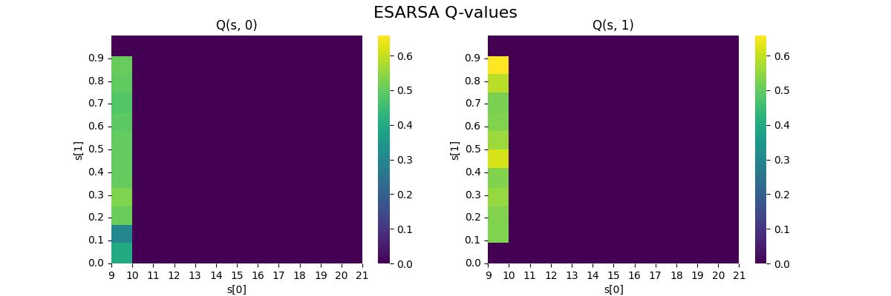
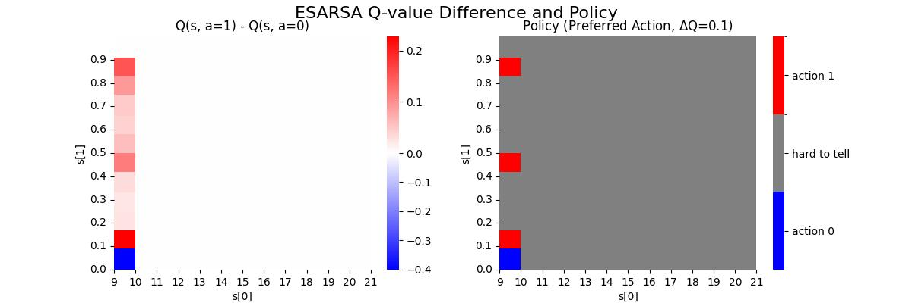
There seems to be increasing preference toward the peak. Is it luck?
### Conclusions & Outlooks: 
- Using state=daily area alone is enough for learning this simple task of off/on. 
- Additional info about the env (e.g. heightened preference for action 1) may be more obvious with just one state dimension.

##  Phase P7
### Objectives: 
- Repeat P6 with state = tod. This was first studied in P3.
### Methods: 
- Added a subclass OfflinePlantGrowthChamber_1hrStep_MC_TimeOnly where state = (toc, 0.0) where the second state dimension is a dummy
- Only use non-constant agent's data as in P3
### Observations: 
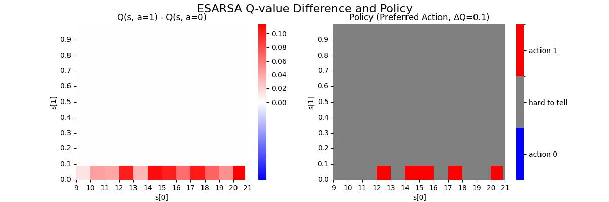
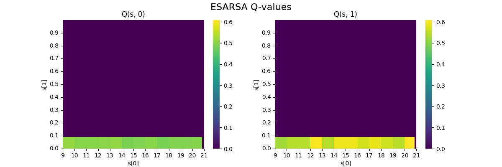
There is indeed a heightened preference for action 1 near the middle of the day. 
### Conclusions & Outlooks: 
- Either state = tod or state = area can learn the optimal policy with MC target. 
- state = (tod, area) LOSES information about where action 1 is the most advantageous (around noon or towards the area peak). This is because the state pairings have destructive interferences.
- I think state = area is prefered because it is more flexible and adaptable to plant's changing behavior.