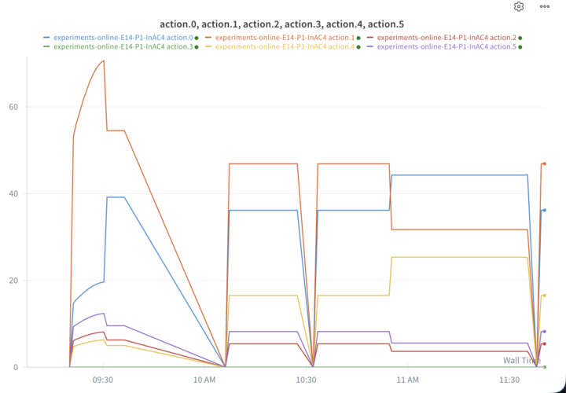
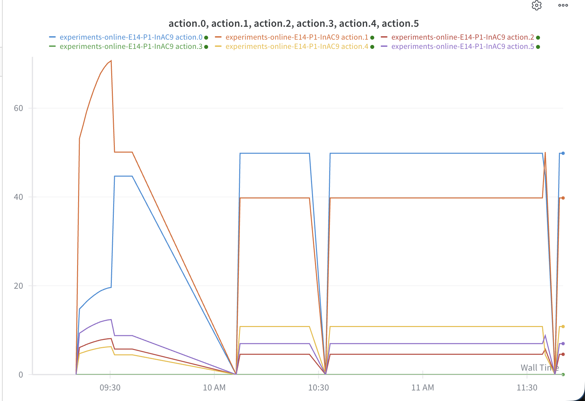

#Experiment description by zones
1. standard white lighting
2. deterministic policy trained on offline dataset, no online learning
3. stochastic policy trained on offline dataset, no online learning
4. stochastic policy trained on offline dataset, no online learning
5. stochastic policy trained on offline dataset, no online learning
6. stochastic policy trained on offline dataset, no online learning
7. None
8. deterministic policy trained on GP, no online learning, optimism = 0
9. deterministic policy trained on GP, no online learning, optimism = 0.25
10. deterministic policy trained on GP, no online learning, optimism = 0.5
11. deterministic policy trained on GP, no online learning, optimism = 0.75
12. deterministic policy trained on GP, no online learning, optimism = 1

#Notes:
##Day 1 
- All agents are InAC. Zones 2-6 agents were trained by data replay. Zones 8 - 12 agents were trained by GP sim.
- State = (day, area, one-hot action, one-hot action trace with beta=0.9)
Action = (red coeff, white coeff, blue coeff), intensity fixed at 105 ppfd
Reward as usual 
- optimism means, when training in GP sim, the "area" in the next state is predicted_mean + optimism * predicted_stdev. So if optimism = 0, it predicts the mean (on average, because GPsim returns a sampled value)
- All InAC agents use the default hypers + weight decay=1e-4.
- Agents trained on data are trained for 1 M  updates.
Agents trained in sim are trained for 1 k GP simulator steps, 100k updates, for some reason this led to better performance when evaluated in the simulator.
- there were a lot of unexpected technical difficulties this time: "X11 forwarding for zone clicking, nvidia drivers, grounding dino and segment anything", which Steven worked through the night before the experiment, thankfully
- today the laptop hardware is failing, with both the battery and power cable malfunctioning. we're gonna try to replace them | the issue may have been fixed by a change in BIOS (switching the power settings from adaptive to primarily AC) | also ordered a backup power adaptor just in case, cuz the cable is shredding on the current one | we need that new computer sooner than later.
- The first 3 hours of data from this morning have been impacted by the battery issue, a checkpointing issue, and wandb network connectivity issues. The main issue is that restarts caused the agent wrapper to lose its state and execute a different action. These issues were fixed by 11:36 AM. We also lost the first 20 minutes of twilight. The data for today may still be useable if we assume the agent took the mean of all the actions taken between 9:30 and 20:30 today. | malfunctioning action of a stochastic InAC

malfunctioning action of a deterministic agent
